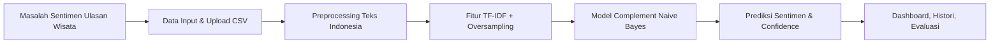
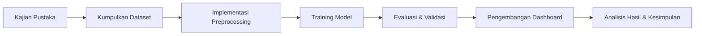

# Kerangka Pemikiran dan Kerangka Penelitian

## 1. Kerangka Pemikiran
Kerangka pemikiran menjelaskan alur logis dari masalah, solusi, dan komponen sistem analisis sentimen yang dikembangkan.

### 1.1 Masalah Utama
- Ulasan wisata Pulau Merak berisi opini pengguna yang beragam.
- Informasi sentimen ini masih tersebar dalam teks bebas dan sulit dianalisis secara manual.
- Dibutuhkan sistem otomatis untuk mengklasifikasikan sentimen ulasan menjadi `positif`, `netral`, dan `negatif`.

### 1.2 Solusi Sistem
Sistem dibangun sebagai aplikasi web dengan alur berikut:
- Input data ulasan (CSV atau teks langsung)
- Preprocessing teks Bahasa Indonesia
- Ekstraksi fitur menggunakan TF-IDF
- Klasifikasi menggunakan Complement Naive Bayes
- Visualisasi hasil dan histori prediksi

### 1.3 Komponen Utama
1. **Data Input**
   - Upload dataset CSV
   - Input teks prediksi langsung
2. **Pra-pemrosesan**
   - Case folding
   - Cleaning
   - Normalisasi slang
   - Tokenisasi
   - Stopword removal (dengan retain negasi)
   - Stemming Sastrawi
3. **Fitur**
   - TF-IDF n-gram (1-2)
   - Oversampling kelas minoritas
4. **Model**
   - Complement Naive Bayes
5. **Output**
   - Prediksi label sentimen
   - Confidence dan probabilitas
   - Dashboard analisis
   - Histori prediksi

### 1.4 Diagram Kerangka Pemikiran

### 1.5 Logika Koneksi
- Data ulasan yang masuk diproses sehingga teks menjadi representasi numerik yang dapat diklasifikasikan.
- Model dikembangkan untuk menangani ketidakseimbangan kelas dan pola bahasa Indonesia.
- Hasil prediksi disimpan dan divalidasi melalui metrik evaluasi.

## 2. Kerangka Penelitian
Kerangka penelitian menjelaskan arah penelitian, variabel, metode, dan teknik analisis yang digunakan.

### 2.1 Tujuan Penelitian
- Mengembangkan sistem analisis sentimen ulasan wisata Pulau Merak.
- Menguji efektivitas Complement Naive Bayes dalam kelasifikasi sentimen Bahasa Indonesia.
- Menyediakan visualisasi hasil dan histori prediksi untuk keputusan pengelolaan destinasi.

### 2.2 Pertanyaan Penelitian
1. Bagaimana performa Complement Naive Bayes dalam menganalisis sentimen ulasan wisata Pulau Merak?
2. Bagaimana efektivitas preprocessing Bahasa Indonesia terhadap akurasi klasifikasi?
3. Apakah visualisasi dashboard membantu memahami distribusi sentimen dan aspek keluhan?

### 2.3 Variabel Penelitian
- Variabel bebas:
  - Teknik preprocessing (normalisasi, stopword removal, stemming)
  - Strategi penyeimbangan data
  - Parameter TF-IDF dan Naive Bayes
- Variabel terikat:
  - Akurasi klasifikasi
  - Precision, recall, F1-score
  - Confusion matrix
  - Persentase prediksi positif/netral/negatif

### 2.4 Metode Penelitian
- **Metode pengembangan**: RUP / iterative prototyping (prototype web + sistem ML)
- **Pendekatan**: Eksperimen kuantitatif dan implementasi sistem
- **Sumber data**: Dataset ulasan wisata Pulau Merak (CSV)
- **Platform**: Flask, PostgreSQL, scikit-learn

### 2.5 Tahapan Penelitian
1. Kajian pustaka dan studi literatur tentang analisis sentimen Bahasa Indonesia.
2. Pengumpulan dataset ulasan wisata.
3. Desain dan implementasi preprocessing teks.
4. Desain model TF-IDF + Complement Naive Bayes.
5. Pelatihan, validasi, dan evaluasi model.
6. Pengembangan antarmuka web dan dashboard.
7. Analisis hasil dan pembahasan.

### 2.6 Rencana Analisis Data
- Validasi model dengan split train/test 80/20.
- Evaluasi menggunakan `accuracy`, `precision`, `recall`, dan `F1-score`.
- Analisis confusion matrix untuk memahami kesalahan klasifikasi.
- Perbandingan label rating asli vs prediksi Naive Bayes.
- Analisis aspek ulasan (kata kunci, tren bulanan, top keywords negatif/positif).

### 2.7 Kerangka Operasional Penelitian

### 2.8 Output yang Diharapkan
- Sistem web fungsional untuk prediksi sentimen.
- Model klasifikasi yang terlatih dan dapat dievaluasi.
- Dashboard visualisasi statistik sentimen.
- Laporan penelitian yang memuat metodologi, eksperimen, dan hasil analisis.

## 3. Rekomendasi Penulisan Bab
- Bab 1: Latar belakang dan rumusan masalah.
- Bab 2: Tinjauan pustaka dan landasan teori.
- Bab 3: Metodologi penelitian (termasuk kerangka pemikiran dan penelitian ini).
- Bab 4: Implementasi dan hasil.
- Bab 5: Kesimpulan dan saran.

---

Dokumen ini dapat digunakan sebagai basis kerangka pemikiran dan kerangka penelitian dalam proposal atau bab metodologi skripsi.
